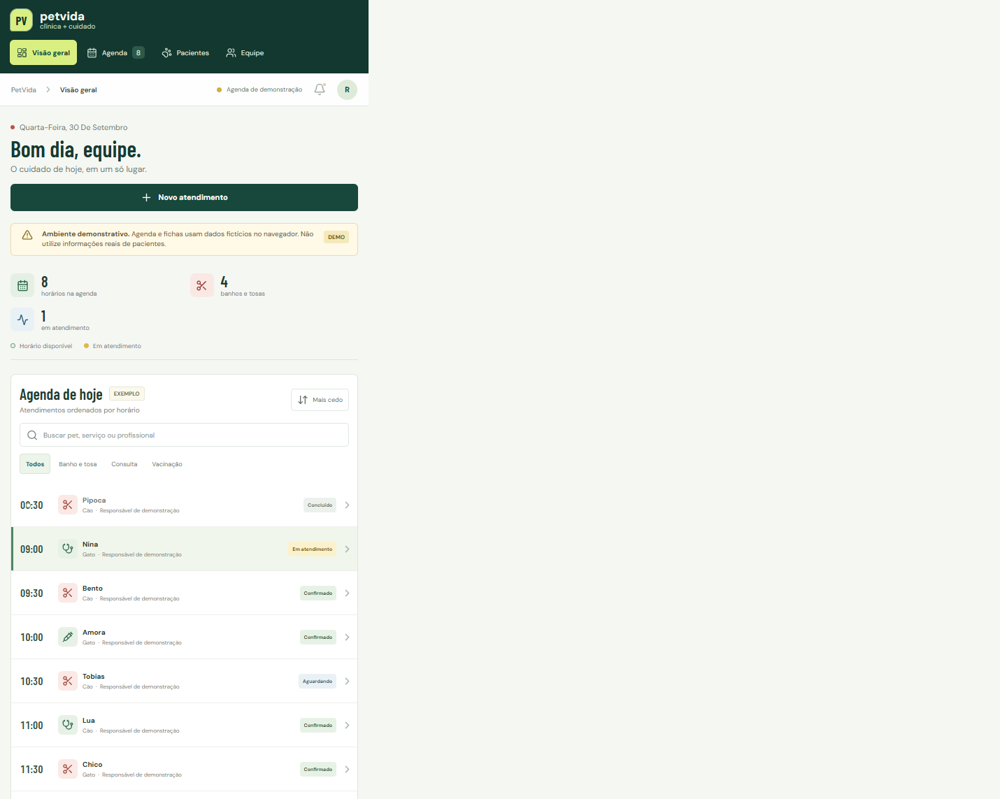
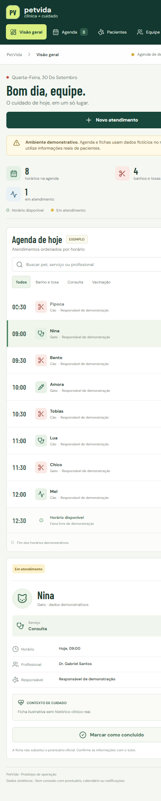

# PetVida Clínica

Protótipo de sistema web para organizar a agenda da clínica veterinária e do centro de estética PetVida. O projeto demonstra uma agenda compartilhada, fichas de atendimento e prevenção de conflitos de horário, com dados fictícios.

> **Aviso:** esta entrega é um protótipo front-end. Não use dados reais de tutores ou animais. Não há autenticação, backend, prontuário clínico, envio de lembretes ou integração com calendário.

## Estudo de caso

### 1. Cenário Atual

A PetVida é uma clínica veterinária e centro de estética de bairro fundada pelo Dr. Gabriel Santos e pela Dra. Camila Paes, sócios em partes iguais. Oferece consultas, vacinação, cirurgias de pequeno porte, banho e tosa. A equipe descrita no briefing inclui mais dois veterinários plantonistas, três tosadores e duas recepcionistas. A agenda ainda é controlada por telefone e caderno na recepção.

### 2. Dor do Cliente

Com mais de 30 banhos por dia e consultas sobrepostas, a operação manual favorece choques de horário, esquecimentos, lacunas não preenchidas e demora na localização de históricos em papel. A falta de lembretes de retornos preventivos também reduz a previsibilidade da agenda e da receita.

### 3. Informações Adicionais

Redes maiores oferecem agendamento simples; o diferencial da PetVida é a confiança na equipe veterinária. A oportunidade de produto é aproximar serviços estéticos e contexto de saúde em um fluxo prático para a recepção, sem perder a responsabilidade clínica.

## Solução e justificativa

A entrega é um **dashboard web responsivo**, em vez de um app nativo ou um site institucional. A recepção e os profissionais precisam consultar e atualizar uma agenda compartilhada durante o expediente; uma aplicação web é acessível nos computadores da clínica e também em telas menores, sem exigir instalação. O trilho de fichas mantém horário, serviço, pet e profissional juntos, e a ficha lateral aproxima o contexto de cuidado do agendamento estético.

O protótipo inclui:

- Agenda por horário com busca, filtros por serviço e status explícito.
- Cadastro demonstrativo de atendimento, com bloqueio de conflito para o mesmo profissional no mesmo horário.
- Ficha lateral com serviço, responsável, profissional e observação de exemplo.
- Visões demonstrativas de pacientes e distribuição da equipe.
- Avisos explícitos de dados sintéticos e de integrações ainda não conectadas.

## Protótipo e telas

Ao executar o projeto, a primeira tela é a **Visão geral**. A navegação lateral abre **Agenda**, **Pacientes** e **Equipe**. Selecione um horário para consultar sua ficha; use **Novo atendimento** para testar o cadastro e a validação de conflito. Os dados são mantidos apenas no estado da página e desaparecem ao recarregar.

Não foram fornecidos protótipos ou imagens oficiais da marca; a interface implementada é o protótipo navegável desta entrega. Todas as fichas e anotações clínicas mostradas são ilustrativas.

### Capturas do protótipo

**Desktop**



**Celular**



## Arquitetura

- **React 18** organiza a interface em componentes e estado local.
- **Vite 6** fornece servidor de desenvolvimento e build estático.
- **lucide-react** fornece os ícones da interface.
- `src/App.jsx`: agenda, navegação, busca, filtros, ficha, formulário e dados demonstrativos.
- `src/styles.css`: tokens visuais, layout adaptável e estados responsivos.
- `.github/workflows/deploy.yml`: build e publicação no GitHub Pages após push em `main`.

Não existe servidor ou armazenamento persistente. Para produção, será necessário implementar autenticação por perfil, API e banco de dados, trilha de auditoria, regras de privacidade e segurança, agenda concorrente e integrações confiáveis para lembretes. Histórico médico real deve ser armazenado e acessado apenas em um sistema apropriado, com controles legais e técnicos.

## Executar localmente

Requisitos: Node.js 20 ou superior e npm.

```bash
npm install
npm run dev
```

Abra a URL local mostrada pelo Vite. Para validar o build de produção:

```bash
npm run build
npm run preview
```

## Publicar no GitHub Pages

1. Crie um repositório GitHub chamado `petvida-clinica` e envie o conteúdo deste projeto para a branch `main`.
2. Em **Settings → Pages**, escolha **GitHub Actions** como origem.
3. O workflow `.github/workflows/deploy.yml` instala dependências, executa o build e publica `dist/`.
4. A URL aparecerá em **Settings → Pages** após a conclusão do primeiro workflow.

O build usa o caminho `/petvida-clinica/` no GitHub Actions. Se o nome do repositório mudar, atualize `base` em `vite.config.js` e este README.

## Segurança e licença

Não há credenciais no código. Arquivos `.env`, saídas de build, dependências e logs estão excluídos pelo `.gitignore`. Nunca inclua tokens, senhas, chaves de API ou dados reais de pacientes no repositório ou no histórico Git. O código é disponibilizado sob a licença MIT; consulte [LICENSE](LICENSE).